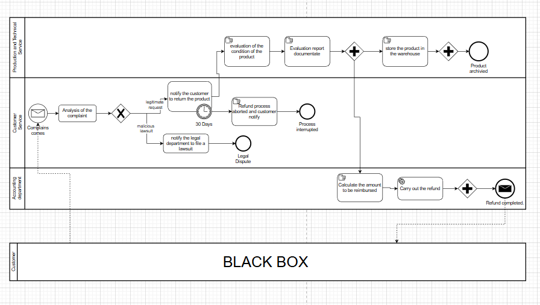
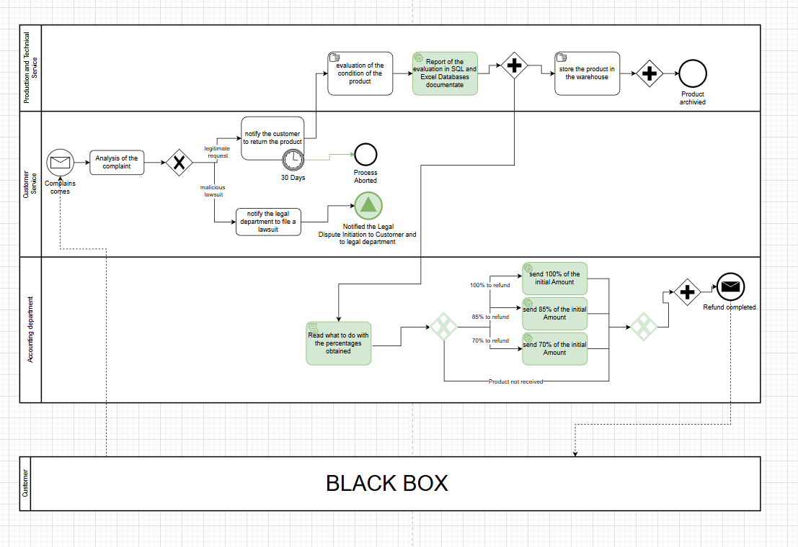
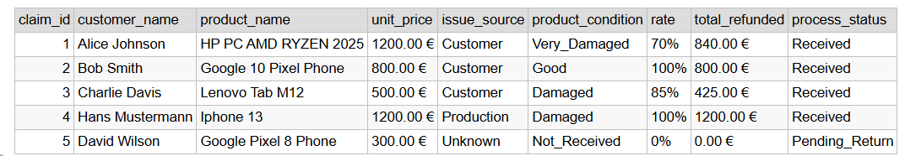
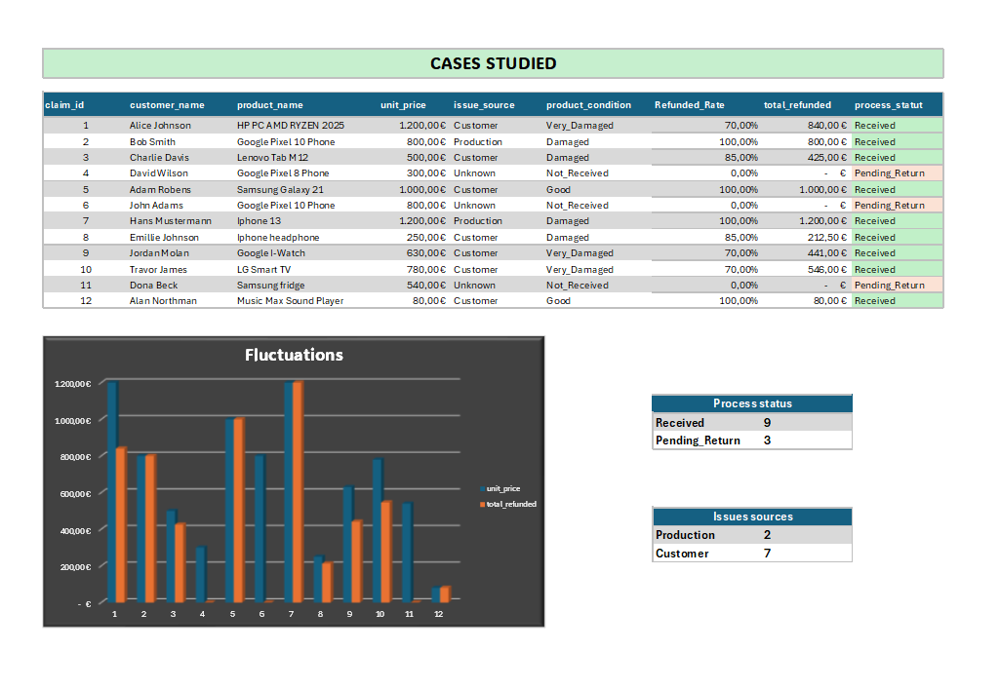

<link href="https://unpkg.com/aos@2.3.1/dist/aos.css" rel="stylesheet">
<link rel="stylesheet" href="https://cdnjs.cloudflare.com/ajax/libs/font-awesome/6.4.0/css/all.min.css">

  

    <a href="./optimization.html" class="inline-flex items-center gap-2 text-xs font-semibold text-emerald-400 hover:underline transition">
      <i class="fa-solid fa-arrow-left"></i> Back to Process Optimization
    </a>
  

  <header class="border-b border-white/10 pb-8 space-y-4" data-aos="fade-down" data-aos-delay="100">
    
      Case Study Analysis
    
    <h1 class="text-3xl md:text-4xl font-extrabold tracking-tight leading-tight">
      
        End-to-End Claim Management Optimization
      
    </h1>
    

      Process Design, Structural Bottlenecks, and Automated Multi-Tiered Financial Reporting Engine
    

  </header>
  
<nav class="sticky top-0 z-50 w-full backdrop-blur-md bg-slate-900/70 border-b border-b-white/10 main-container py-4">
    

        <a href="#home" class="text-sm font-bold tracking-wider text-white hover:text-cyan-400 transition-colors uppercase">
            ⚡ End-To-End Claims
        </a>       
        

            <a href="#problem-statement" class="text-slate-300 hover:text-cyan-400 transition-colors">Problem Statement</a>
            <a href="#bpmn-section" class="text-slate-300 hover:text-cyan-400 transition-colors">BPMN Process</a>
            <a href="#sql-section" class="text-slate-300 hover:text-cyan-400 transition-colors">SQL Database</a>
            <a href="#excel-section" class="text-slate-300 hover:text-cyan-400 transition-colors">Excel Results</a>
            <a href="#deliverables" class="text-slate-300 hover:text-cyan-400 transition-colors">Deliverables</a>
        

    

</nav>

  <section class="glass-card p-6 rounded-xl space-y-4" data-aos="fade-up">
    <h2 class="text-xl font-bold flex items-center gap-2">
      <i class="fa-solid fa-circle-info text-cyan-400"></i>
      Introduction & Process Description
    </h2>
    

      Throughout what follows, the process described is that of a customer return followed by a claim. Failures will be identified, modeled, and a proposed solution will be resolved.
    

    

      

        The customer submits a complaint to the company after receiving the package. Customer Service receives and reviews the claim, deciding either to initiate the return process or to escalate the matter to the Legal Department. In the event of legal action, the return procedure is immediately suspended. If the return is deemed legitimate, the customer receives an email requesting they ship the product back within 30 days; otherwise, the process is terminated and marked as aborted.
      

      

        Once the product is received, technicians perform a quality inspection to assess its condition. If the item is in good condition and the defect originated during production, the Accounting Department is notified to issue a full 100% refund. If the product was damaged by the customer, a notification is sent to Accounting to process a partial refund of 85%, or 70% if the product is severely damaged.
      

      

        Simultaneously, the technicians log the product details into the Excel database and store the item in the warehouse. Meanwhile, the accountant calculates the final refund amount and executes the payment, thus concluding the process.
      

    

  </section>

  <section class="glass-card p-6 rounded-xl space-y-4" data-aos="fade-up" data-aos-delay="100">
    <h2 class="text-xl font-bold flex items-center gap-2">
      <i class="fa-solid fa-magnifying-glass-chart text-emerald-400"></i>
      Interpretation of the Situation
    </h2>
    

      The process is structured around strict decision-making flows where technical and accounting actions are interdependent:
    
   
    

      

        <i class="fa-solid fa-gavel"></i> Receipt & Validation
        
<strong>Case A (Legitimate):</strong> Initiation of the return procedure. The customer is notified and has a 30-day window to return the product.

        
<strong>Case B (Abusive/Slanderous):</strong> Immediate termination of the return flow and escalation to legal counsel for defamation proceedings.

      

      

        <i class="fa-solid fa-calculator"></i> Business Rules for Refunds
        <ul class="space-y-1 text-slate-300">
          <li>• <strong class="text-white">100% Refund:</strong> If the issue is a production defect OR if it's a customer defect AND the product is in good condition.</li>
          <li>• <strong class="text-white">85% Refund:</strong> If the issue is customer-related BUT the product is damaged.</li>
          <li>• <strong class="text-white">70% Refund:</strong> If the issue is customer-related AND the product is very damaged.</li>
        </ul>
      

    

    
<i class="fa-solid fa-circle-exclamation"></i> Return Period Management: If the product is not received within the 30-day deadline, the procedure is permanently aborted.

  </section>

  <section class="glass-card p-6 rounded-xl space-y-4" data-aos="fade-up">
    <h2 class="text-xl font-bold flex items-center gap-2">
      <i class="fa-solid fa-triangle-exclamation text-yellow-500"></i>
      Problem Statement
    </h2>
    

      An audit of the current Excel-based system reveals several critical flaws regarding task synchronization and data integrity:
    

    

      

        <strong class="text-red-400"><i class="fa-solid fa-ban"></i> Lack of Parallelism:</strong> Currently, the process relies on a linear ‘handover’—technicians fill out their reports, and accounting must then manually consult the file to perform calculations. This sequential workflow causes data reading errors and significant payment delays.
      

      

        <strong class="text-red-400"><i class="fa-solid fa-gears"></i> Business Rule Complexity:</strong> The multi-tiered refund structure (100%, 85%, 70%) based on the intersection of two variables (Issue Source vs. Product Condition) makes manual data entry in Excel extremely high-risk for financial inaccuracies.
      

      

        <strong class="text-red-400"><i class="fa-solid fa-eye-slash"></i> Invisibility of Legal Exceptions:</strong> Claims escalated to the Legal Department (e.g., defamation cases) often fall off the standard tracking radar, creating a disconnect between Customer Service and the Legal team.
      

      

        <strong class="text-red-400"><i class="fa-solid fa-clock"></i> Inefficient Deadline Management (Time-Outs):</strong> No automated alerts are generated at the 30-day mark (J+30). This forces a manual, line-by-line review to identify expired claims that should be aborted, leading to wasted operational hours.
      

    

  </section>

  <h3 class="text-xs font-bold text-cyan-400 mb-4 uppercase tracking-widest">Process Flowchart (BPMN 2.0)</h3>
  
  
Visual representation of the initial decision-making flow.

  <section class="glass-card p-6 rounded-xl space-y-4" data-aos="fade-up" data-aos-delay="100">
    <h2 class="text-xl font-bold flex items-center gap-2">
      <i class="fa-solid fa-square-poll-horizontal text-emerald-400"></i>
      The Optimized Process
    </h2>
    

      In this phase, I optimized the manual claim process by implementing a structured data model and automated calculation rules.
    

    

      

        <h3 class="text-sm font-bold text-white uppercase tracking-wider">Key Improvements</h3>
        <ul class="space-y-2 text-xs text-slate-300 text-justify">
          <li class="flex items-start gap-1.5">
            <i class="fa-solid fa-bolt text-emerald-400 mt-0.5"></i>
            <strong>Logic Automation:</strong> Replaced manual refund estimations with precise SQL-based logic (CASE WHEN) and Excel formulas.
          </li>
          <li class="flex items-start gap-1.5">
            <i class="fa-solid fa-shield-halved text-emerald-400 mt-0.5"></i>
            <strong>Financial Accuracy:</strong> Developed a calculation engine that automatically applies 70%, 85%, or 100% refund rates based on product condition and issue source.
          </li>
          <li class="flex items-start gap-1.5">
            <i class="fa-solid fa-hourglass-end text-emerald-400 mt-0.5"></i>
            <strong>Time-Fencing:</strong> Integrated a “30-day rule” to automatically flag or abort expired claims, protecting company cash flow.
          </li>
        </ul>
      

      

        <h3 class="text-sm font-bold text-white uppercase tracking-wider">Tools & Implementation</h3>
        <ul class="space-y-2 text-xs text-slate-300 text-justify">
          <li class="flex items-start gap-1.5">
            <i class="fa-solid fa-code text-cyan-400 mt-0.5"></i>
            <strong>SQL Implementation:</strong> Enforced strict business constraints using ENUM types and automated updates.
          </li>
          <li class="flex items-start gap-1.5">
            <i class="fa-solid fa-table text-cyan-400 mt-0.5"></i>
            <strong>Excel:</strong> Consolidated multiple fragmented data sources to create a unified reporting view.
          </li>
          <li class="flex items-start gap-1.5">
            <i class="fa-solid fa-calculator text-cyan-400 mt-0.5"></i>
            <strong>Formulas:</strong> Used nested IF and AND (WENN/UND) logic to ensure zero errors on edge cases (e.g., “Unknown” sources).
          </li>
        </ul>
      

    

    

      <i class="fa-solid fa-circle-check text-2xl text-emerald-400"></i>
      
        Result: Reduced manual processing time and human calculation errors.
      
    

  </section>
  

  <h3 class="text-xs font-bold text-cyan-400 mb-4 uppercase tracking-widest">Process Flowchart (BPMN 2.0)</h3>
  
  
Visual representation of the optimized decision-making flow.

  <section class="glass-card p-6 rounded-xl space-y-4" data-aos="fade-up">
    <h2 class="text-xl font-bold flex items-center gap-2">
      <i class="fa-solid fa-database text-cyan-400"></i>
      SQL Database Architecture
    </h2>
    

      Below is the comprehensive relational schema script, business validation logic constraints, and data reporting generation pipeline implemented to resolve the operational gaps:
    

    

      
-- 1. Table Creation with Strict Business Constraints

      
CREATE TABLE Claim_Management (

      
claim_id INT PRIMARY KEY AUTO_INCREMENT,

      
customer_name VARCHAR(100) NOT NULL,

      
product_name VARCHAR(100) NOT NULL,

      
product_price DECIMAL(10,2) NOT NULL,

      
claim_date DATE NOT NULL,

      
process_status ENUM('Pending_Return', 'Received', 'Aborted', 'Legal_Dispute') DEFAULT 'Pending_Return',

      
product_condition ENUM('Good', 'Damaged', 'Very_Damaged', 'Not_Received') DEFAULT 'Not_Received',

      
issue_source ENUM('Production', 'Customer', 'Unknown') DEFAULT 'Unknown',

      
refund_percentage INT DEFAULT 0,

      
refund_amount DECIMAL(10,2) DEFAULT 0.00

      
);

      
-- 2. Mock Data Insertion (2026 Audit Dataset)

      
INSERT INTO Claim_Management (customer_name, product_name, product_price, claim_date, process_status, product_condition, issue_source)

      
VALUES

      
('Alice Johnson', 'HP PC AMD RYZEN 2025', 1200.00, '2026-05-01', 'Received', 'Very_Damaged', 'Customer'),

      
('Bob Smith', 'Google 10 Pixel Phone', 800.00, '2026-05-05', 'Received', 'Good', 'Customer'),

      
('Charlie Davis', 'Lenovo Tab M12', 500.00, '2026-05-08', 'Received', 'Damaged', 'Customer'),

      
('Hans Mustermann', 'Iphone 13', 1200.00, '2026-05-04', 'Received', 'Damaged', 'Production'),

      
('David Wilson', 'Google Pixel 8 Phone', 300.00, '2026-04-01', 'Pending_Return', 'Not_Received', 'Unknown');

      
-- 3. Corrected Multi-Tiered Matrix Logic Execution

      
UPDATE Claim_Management

      
SET refund_percentage = CASE

      
WHEN issue_source = 'Customer' AND product_condition = 'Good' THEN 100

      
WHEN issue_source = 'Production' AND product_condition = 'Damaged' THEN 100

      
WHEN issue_source = 'Customer' AND product_condition = 'Damaged' THEN 85

      
WHEN issue_source = 'Customer' AND product_condition = 'Very_Damaged' THEN 70

      
ELSE 0

      
END

      
WHERE process_status = 'Received';

      
-- 4. Financial Calculations Layer

      
UPDATE Claim_Management

      
SET refund_amount = (product_price * refund_percentage / 100)

      
WHERE process_status = 'Received';

      
-- 5. Final Granular Audit View Output

      
SELECT claim_id, customer_name, product_name,

      
CONCAT(product_price, ' €') AS unit_price, issue_source, product_condition,

      
CONCAT(refund_percentage, '%') AS rate,

      
CONCAT(refund_amount, ' €') AS total_refunded, process_status

      
FROM Claim_Management;

    

    
  

      <h3 class="text-xs font-bold text-cyan-400 mb-4 uppercase tracking-widest">Table with the previous mySQL code</h3>
      
      
Visual Table of the data compiled from the database terminal.

  

    

      <i class="fa-solid fa-circle-check text-2xl text-emerald-400"></i>
      
        Result: Visualisation of the optimized Datas and significant reduction of humans' errors.
      
    

  </section>

    <h3 class="text-xs font-bold text-cyan-400 mb-4 uppercase tracking-widest">Representation in Excel</h3>
    
    
Case Studies in Excel consolidated with Power Query.

  

  
<section id="deliverables" class="mt-12 grid grid-cols-1 md:grid-cols-2 gap-6" data-aos="fade-up">  
    

        

            <h3 class="text-xs font-bold text-cyan-400 mb-4 uppercase tracking-widest flex items-center gap-2">
                <i class="fas fa-history text-amber-500"></i> Initial Case Documents
            </h3>
            

                Download the original files and the legacy workflow mapping before the automation process.
            

        
        
        

            <a href="./documents/process-overview.pdf" download class="flex items-center justify-between p-3 bg-white/5 hover:bg-white/10 rounded-lg border border-white/5 transition-all group">
                

                    <i class="fas fa-file-pdf text-rose-500 group-hover:scale-110 transition-transform"></i>
                    Process Overview (PDF)
                

                <i class="fas fa-arrow-alt-circle-down text-slate-400 group-hover:text-emerald-400 transition-colors"></i>
            </a>
            <a href="./documents/process-initial.drawio" download class="flex items-center justify-between p-3 bg-white/5 hover:bg-white/10 rounded-lg border border-white/5 transition-all group">
                

                    <i class="fas fa-project-diagram text-orange-400 group-hover:scale-110 transition-transform"></i>
                    Initial BPMN Process (DRAW.IO)
                

                <i class="fas fa-arrow-alt-circle-down text-slate-400 group-hover:text-emerald-400 transition-colors"></i>
            </a>
        

    

    

        

            <h3 class="text-xs font-bold text-cyan-400 mb-4 uppercase tracking-widest flex items-center gap-2">
                <i class="fas fa-magic text-emerald-400"></i> Optimized Solutions
            </h3>
            

                Access the automated architecture, engineered scripts, and dynamic data visualizations.
            

        
        
        

            <a href="./documents/bpmn-claims-optimized.drawio" download class="flex items-center justify-between p-3 bg-white/5 hover:bg-white/10 rounded-lg border border-white/5 transition-all group">
                

                    <i class="fas fa-project-diagram text-emerald-400 group-hover:scale-110 transition-transform"></i>
                    Optimized BPMN Process (DRAW.IO)
                

                <i class="fas fa-arrow-alt-circle-down text-slate-400 group-hover:text-emerald-400 transition-colors"></i>
            </a>
            <a href="./database/script.sql" download class="flex items-center justify-between p-3 bg-white/5 hover:bg-white/10 rounded-lg border border-white/5 transition-all group">
                

                    <i class="fas fa-code text-blue-400 group-hover:scale-110 transition-transform"></i>
                    MySQL Database Script (Open with VS Code)
                

                <i class="fas fa-arrow-alt-circle-down text-slate-400 group-hover:text-emerald-400 transition-colors"></i>
            </a>
            <a href="./documents/excel-visualisation.xlsx" download class="flex items-center justify-between p-3 bg-white/5 hover:bg-white/10 rounded-lg border border-white/5 transition-all group">
                

                    <i class="fas fa-file-excel text-green-500 group-hover:scale-110 transition-transform"></i>
                    Excel Visualisation Dashboard (XLSX)
                

                <i class="fas fa-arrow-alt-circle-down text-slate-400 group-hover:text-emerald-400 transition-colors"></i>
            </a>
        

    

    

        

            <h3 class="text-xs font-bold text-cyan-400 mb-1 uppercase tracking-widest flex items-center justify-center sm:justify-start gap-2">
                <i class="fas fa-share-alt text-purple-400"></i> Connect with me
            </h3>
            

                Interested in process optimization and data engineering? Let's discuss this project on my networks.
            

        

        

            <a href="https://www.linkedin.com/in/winston-engamba-7b3489325/" target="_blank" rel="noopener noreferrer" 
               class="w-10 h-10 flex items-center justify-center rounded-lg bg-white/5 hover:bg-[#0077b5]/20 border border-white/5 hover:border-[#0077b5]/50 text-slate-300 hover:text-[#0077b5] transition-all duration-300 text-sm group" title="LinkedIn">
                <i class="fab fa-linkedin-in group-hover:scale-110 transition-transform"></i>
            </a>
            <a href="https://github.com/wero-git/" target="_blank" rel="noopener noreferrer" 
               class="w-10 h-10 flex items-center justify-center rounded-lg bg-white/5 hover:bg-white/20 border border-white/5 hover:border-white/50 text-slate-300 hover:text-white transition-all duration-300 text-sm group" title="GitHub">
                <i class="fab fa-github group-hover:scale-110 transition-transform"></i>
            </a>
            <a href="mailto:rodokomon24@gmail.com" 
               class="w-10 h-10 flex items-center justify-center rounded-lg bg-white/5 hover:bg-emerald-500/20 border border-white/5 hover:border-emerald-500/50 text-slate-300 hover:text-emerald-400 transition-all duration-300 text-sm group" title="Email">
                <i class="fas fa-envelope group-hover:scale-110 transition-transform"></i>
            </a>
        

    

</section>

    

        © 2026 - End-to-End Claims Optimization Project. All rights reserved.
    

        <a href="#home" class="flex items-center gap-2 text-slate-400 hover:text-cyan-400 transition-all duration-300 group font-medium uppercase tracking-wider">
        Back to top 
        <i class="fas fa-arrow-up group-hover:-translate-y-1 transition-transform text-emerald-400"></i>
    </a>

  

    <a href="./index.html" class="inline-flex items-center gap-2 text-sm font-semibold text-cyan-400 hover:underline transition">
      <i class="fa-solid fa-house"></i> Back Home
    </a>
  

